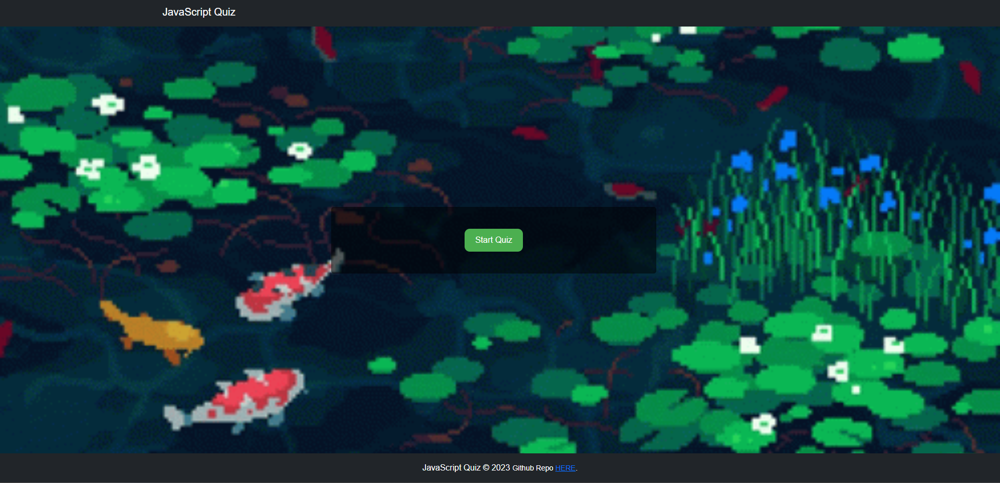

# JavaScript Quiz

A timed quiz on JavaScript fundamentals that stores high scores, allowing users to gauge their progress compared to their peers.

## Live Demo

[Click here for a live demo](ishaval.github.io/Challenge-4/)

## Features

- Timed multiple-choice quiz
- High score storage and retrieval
- Responsive design using Bootstrap

## Technologies Used

- HTML
- CSS
- JavaScript
- Bootstrap

## Installation

1. Clone the repository or download the source code as a zip file.
 git clonehttps://github.com/Ishaval/Challenge-4.git

 2. Open the `index.html` file in your web browser to start the quiz.

## License

This project is licensed under the MIT License. See the [LICENSE](./LICENSE) file for details.
